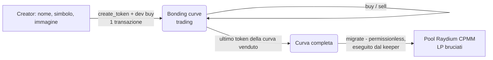

# Solana Launchpad

Launchpad "fair launch" per token su Solana, stile pump.fun: chiunque crea una moneta con **una sola transazione**, la moneta si scambia subito su una **bonding curve** e, quando la curva è completata, la liquidità passa **automaticamente su Raydium** con gli LP token bruciati (liquidità bloccata per sempre).

Il repository contiene tutto il codice "non grafico": programma on-chain, SDK TypeScript per il frontend, backend (indexer + API + keeper), CLI e test. Nome, logo e stile del sito sono il passo successivo (vedi [Prossimi passi](#prossimi-passi)).

| Parte | Cartella | Tecnologia |
|---|---|---|
| Programma on-chain | `programs/launchpad` | Rust, Anchor 1.2, Token-2022 |
| SDK per il frontend | `sdk` | TypeScript, `@anchor-lang/core`, `@solana/web3.js` |
| Indexer, API REST, stream live, keeper | `backend` | Node 22, Hono, SQLite (`node:sqlite`) |
| CLI admin/test, validator locale | `scripts` | TypeScript, bash |

---

## Come funziona



1. **Lancio** – `create_token` crea un mint Token-2022 con metadati *on-chain* (nome, simbolo, URI) resi immutabili, conia l'intera supply nel vault della curva e **revoca la mint authority**: nessuno potrà mai coniare altri token. Non esiste freeze authority. Il creator può fare il primo acquisto ("dev buy") nella stessa transazione, così nessuno compra prima di lui.
2. **Trading sulla curva** – prezzo determinato da una curva a prodotto costante su riserve *virtuali* (`x · y = k`): nessuno deve fornire liquidità iniziale. Ogni trade paga una fee (protocollo + creator).
3. **Completamento** – quando sono stati venduti tutti i token della curva, il trading si chiude.
4. **Graduation** – chiunque (in pratica il keeper del backend) chiama `migrate`: il SOL raccolto e i token riservati creano un pool **Raydium CPMM** allo stesso prezzo finale della curva, gli **LP token vengono bruciati** e il surplus di token viene bruciato. Da quel momento il token è su Raydium, Jupiter, DexScreener, ecc.

### Economia di default (configurabile)

| Parametro | Valore |
|---|---|
| Supply totale (fissa) | 1.000.000.000 token (6 decimali) |
| Token venduti sulla curva | 793.100.000 (79,31%) |
| Token riservati alla liquidità DEX | 206.900.000 |
| Riserve virtuali iniziali | 30 SOL / 1.073.000.000 token |
| Market cap iniziale | ~28 SOL |
| SOL raccolti a curva completa | ~85,0 SOL (~86,3 SOL pagati dai compratori, fee incluse) |
| Market cap alla graduation | ~411 SOL |
| Fee di trading | 1% protocollo + 0,5% creator (max 5% totale, vincolo on-chain) |
| Fee di creazione | 0,02 SOL (max 1 SOL) |
| Fee di migrazione | 0,5 SOL (max 10 SOL) |
| Costo Raydium (fee pool 0,15 SOL + rent) | ~0,19 SOL |
| Pool Raydium alla graduation | ~84,3 SOL + ~205,2M token (~1,7M token bruciati) |

---

## Programma on-chain

### Istruzioni

| Istruzione | Chi | Cosa fa |
|---|---|---|
| `initialize(params)` | solo l'upgrade authority del programma | crea la config globale (impossibile front-runnarla dopo il deploy) |
| `update_config(params)` | admin | fee di trading, parametri curva e fee di migrazione (solo per i token futuri), fee tier Raydium |
| `set_paused(create, trading)` | admin | interruttori di emergenza |
| `transfer_admin` / `accept_admin` | admin / nuovo admin | passaggio di consegne in due step |
| `create_token(name, symbol, uri)` | chiunque | lancia un token |
| `buy(sol_amount, min_token_amount)` | chiunque | spende **al massimo** `sol_amount` lamport (fee incluse) |
| `sell(token_amount, min_sol_amount)` | chiunque | vende esattamente `token_amount` token |
| `claim_creator_fees()` | creator del token | incassa la sua quota di fee (anche dopo la migrazione) |
| `collect_protocol_fees()` | chiunque | invia le fee di protocollo accumulate al `fee_recipient` |
| `migrate()` | chiunque | porta una curva completata su Raydium |

### Account (PDA)

| Account | Seeds | Contenuto |
|---|---|---|
| `Config` | `["config"]` | admin, fee, parametri curva, fee tier Raydium, pause |
| `BondingCurve` | `["bonding_curve", mint]` | riserve, fee non riscosse, stato; detiene i SOL della curva come lamport |
| vault della curva | ATA Token-2022 di `BondingCurve` | token non ancora venduti |
| `pool_creator` | `["pool_creator", mint]` | PDA di sistema che crea il pool Raydium e brucia gli LP (svuotato a fine migrazione) |
| pool Raydium | `["raydium_pool", mint]` | indirizzo del pool CPMM (vedi sicurezza) |

Gli eventi (`TokenCreated`, `Trade`, `CurveCompleted`, `Migrated`, `CreatorFeesClaimed`, `ProtocolFeesCollected`, `ConfigUpdated`) sono emessi con `emit_cpi!`: finiscono nelle inner instruction della transazione e non possono essere persi per troncamento dei log.

### Sicurezza e garanzie

- **Supply fissa e trasparente**: mint authority revocata, nessuna freeze authority, metadati immutabili, nessuna estensione pericolosa (niente transfer fee, hook, permanent delegate).
- **Matematica conservativa**: `u128` con aritmetica controllata; ogni arrotondamento favorisce la curva, quindi `k` non diminuisce mai e la curva può sempre ripagare chi vende. Verificato con property test (migliaia di sequenze casuali) e vettori condivisi Rust ↔ TypeScript.
- **Slippage** su ogni trade; il buy che completa la curva paga solo i token rimasti, non l'intero budget.
- **Trading parallelo**: SOL e fee restano nell'account della curva, quindi un trade blocca in scrittura solo account di quel token (nessun "hot account" globale).
- **Migrazione non front-runnabile**: il pool Raydium usa un indirizzo che solo il programma può firmare (`["raydium_pool", mint]`), non il PDA canonico che chiunque potrebbe creare prima. Gli account temporanei sono creati in modo idempotente e i token "regalati" per bloccare la chiusura vengono bruciati: testato con scenari di griefing.
- **Raydium non configurabile**: l'ID del programma Raydium è una costante compilata (mainnet di default, devnet con `--features devnet`). Nemmeno l'admin può dirottare la liquidità di una curva completata.
- **Limiti on-chain** alle fee (5% trading, 1 SOL creazione, 10 SOL migrazione).
- **Graduation sempre possibile**: la config viene rifiutata se una curva completata non raccoglierebbe almeno fee di migrazione + 1 SOL per il pool, e la fee di migrazione è fissata nel token al momento del lancio (un cambio di config successivo non vale per i token esistenti).

**Poteri dell'admin (modello di fiducia)** – l'admin può: cambiare le fee di trading entro i limiti, cambiare parametri curva e fee di migrazione *dei token futuri*, mettere in pausa creazione e trading (anche le vendite), scegliere il fee tier Raydium. **Non** può: toccare i SOL delle curve, coniare token, cambiare metadati, cambiare il programma Raydium. L'**upgrade authority** del programma invece può cambiare il codice: in produzione va messa sotto multisig (es. Squads) con timelock.

> ⚠️ Il codice è testato ma **non è stato sottoposto ad audit**. Prima di gestire fondi reali su mainnet serve un audit di sicurezza indipendente.

---

## SDK (`sdk/`)

```ts
import { Connection, Keypair } from "@solana/web3.js";
import { LaunchpadClient, solToLamports, tokensToUnits } from "@launchpad/sdk";

const client = new LaunchpadClient(new Connection("https://api.devnet.solana.com"));

// 1. Lancio + dev buy: la transazione è già firmata dal mint, manca solo il wallet
const { transaction, mint } = await client.createTokenTransaction({
  creator: wallet.publicKey,
  name: "Moon Cat",
  symbol: "MCAT",
  uri, // restituito da POST /api/metadata del backend
  initialBuyLamports: solToLamports("0.5"),
  options: { priorityFeeMicroLamports: 50_000 },
});
await wallet.signTransaction(transaction); // wallet adapter

// 2. Quote e buy/sell con slippage
const { instructions, quote } = await client.buyInstructions({
  buyer: wallet.publicKey, mint: mint.publicKey, solAmount: solToLamports(1), slippageBps: 100,
});
const tx = await client.buildTransaction(instructions, wallet.publicKey, { computeUnits: 100_000 });

// 3. Letture per la UI
const curve = await client.fetchBondingCurve(mint.publicKey);
const config = await client.fetchConfig();
const { priceSol, marketCapSol, progress } = LaunchpadClient.metrics(curve!, config);
```

Contenuto principale: `LaunchpadClient` (letture, quote, builder per ogni istruzione, transazioni v0 con compute budget e priority fee), matematica esatta in `bigint` (`quoteBuy`, `quoteSell`, `solCostForTokens`, prezzo, market cap, progresso), PDA, decodifica eventi (`parseTransactionEvents`), conversioni sicure (`solToLamports`, `tokensToUnits`, ...).

---

## Backend (`backend/`)

Un unico processo con tre componenti (attivabili via env, vedi `backend/.env.example`):

- **Indexer**: legge le transazioni del programma in ordine di catena (`getSignaturesForAddress` + cursore, risveglio via websocket), decodifica gli eventi e li salva in SQLite. Idempotente e ripartibile. Richiede un RPC con storico completo (es. Helius/Triton) se parte dopo il deploy.
- **API REST + stream live** (porta 8787):

| Endpoint | Descrizione |
|---|---|
| `GET /api/tokens?sort=new\|market_cap\|last_trade\|trending\|progress&status=&q=&creator=&limit=&offset=` | lista token |
| `GET /api/tokens/:mint` | dettaglio token + dati della graduation |
| `GET /api/tokens/:mint/trades?limit=&before=` | storico trade (paginato) |
| `GET /api/tokens/:mint/candles?interval=1m\|5m\|15m\|1h\|4h\|1d&from=&to=` | candele OHLCV per i grafici |
| `GET /api/users/:wallet/trades`, `GET /api/users/:wallet/tokens` | profilo utente |
| `GET /api/stats`, `GET /api/config` | statistiche e config on-chain |
| `GET /api/stream?mint=` | Server-Sent Events: `tokenCreated`, `trade`, `curveCompleted`, `migrated` |
| `POST /api/metadata` (multipart: `image`, `name`, `symbol`, `description`, `twitter`, `telegram`, `website`) | carica immagine + JSON metadati, restituisce l'`uri` da passare a `create_token` |

- **Keeper**: migra su Raydium ogni curva completata appena possibile (e opzionalmente raccoglie le fee di protocollo). Paga solo le fee di rete: basta un wallet con ~0,05 SOL.

Storage dei metadati: `local` (sviluppo, file serviti da `/files`) o `pinata` (IPFS). Il fetch dei metadati di terzi è protetto da SSRF (niente IP privati/interni, redirect ricontrollati, limiti di tempo e dimensione); le immagini sono validate dai magic bytes.

---

## Sviluppo locale

### Prerequisiti

- Rust (via `rustup`; la versione è fissata in `rust-toolchain.toml`)
- Agave/Solana CLI 4.2.x: `sh -c "$(curl -sSfL https://release.anza.xyz/stable/install)"`
- Anchor CLI 1.2.0: `npm i -g @anchor-lang/cli@1.2.0`
- Node.js ≥ 22.13

### Primo avvio

```bash
npm install
solana-keygen new                # se non hai ancora un wallet locale
anchor keys sync                 # genera il TUO program id e aggiorna declare_id!/Anchor.toml
anchor build                     # programma + IDL
npm run sync-idl                 # copia l'IDL nell'SDK
npm run build -w sdk
```

### Test

```bash
anchor test                      # build + tutti i test Rust (equivale a anchor build && cargo test -p launchpad)
cargo test -p launchpad          # unit + property test + integrazione LiteSVM (con il vero Raydium di mainnet)
npm test -w sdk                  # matematica (parità con Rust) e PDA
npm test -w backend              # API, candele, upload, SSE, protezione SSRF

# end-to-end su validator locale (programma + copia di Raydium CPMM)
npm run localnet                 # terminale 1
npm run test:e2e -w sdk          # terminale 2: lancio → trade → graduation su Raydium
npm run test:e2e -w backend      # indexer + keeper
```

### Stack completo in locale

```bash
npm run localnet                                   # validator
npm run cli -- init                                # config (sei l'upgrade authority)
cp backend/.env.example backend/.env               # opzionale
npm run build -w backend && npm start -w backend   # API su http://localhost:8787
npm run cli -- create --name "Test Coin" --symbol TEST --uri https://example.com/t.json --buy 0.5
npm run cli -- list
```

Comandi CLI: `init`, `update-config`, `pause`, `config`, `create`, `buy`, `sell`, `curve`, `list`, `claim`, `migrate` (`npm run cli` per l'elenco completo, `--url devnet|mainnet|<rpc>` per cambiare rete).

---

## Deploy su devnet

```bash
solana config set --url devnet
solana airdrop 5                                  # o https://faucet.solana.com (servono ~3,5 SOL per il deploy)
anchor keys sync
anchor build -- --features devnet                 # usa il programma Raydium CPMM di devnet
npm run sync-idl && npm run build -w sdk
anchor deploy --provider.cluster devnet
npm run cli -- init --url devnet --raydium devnet --fee-recipient <TUO_WALLET_FEE>
npm run cli -- create --url devnet --name "Devnet Coin" --symbol DEV --uri <uri> --buy 0.1
```

Il `fee_recipient` deve esistere ed essere rent-exempt (basta inviargli un po' di SOL).

### Checklist per mainnet

- [ ] Audit di sicurezza del programma
- [ ] Upgrade authority e admin su multisig (Squads), con timelock per gli upgrade
- [ ] Build verificabile (`anchor build --verifiable`) e verifica pubblica del codice
- [ ] RPC dedicato con storico completo per l'indexer; database con backup
- [ ] Storage permanente dei metadati (IPFS con pinning o Arweave), non `local`
- [ ] Keeper con wallet dedicato e monitoraggio/alert
- [ ] Rate limiting e reverse proxy davanti all'API
- [ ] Revisione legale (termini d'uso, giurisdizioni, disclaimer sui rischi)

---

## Struttura del repository

```
programs/launchpad/src/
  lib.rs                 entrypoint e istruzioni
  state.rs               Config, BondingCurve, ConfigParams (con validazione)
  math.rs                matematica della curva e fee (+ unit/property test)
  raydium.rs             binding CPI minimi per Raydium CPMM
  instructions/          admin, create_token, trade (buy/sell), fees, migrate
programs/launchpad/tests/ integrazione LiteSVM: admin, trading, migrazione, compute unit, vettori
tests/fixtures/          Raydium CPMM (programma + account) copiato da mainnet, vettori matematici
sdk/                     SDK TypeScript (+ test e2e)
backend/                 indexer, API, keeper (+ test)
scripts/                 cli.ts, localnet.sh, sync-idl.mjs
```

Consumi misurati (compute unit): `create_token` ~68k, `buy` ~27k (~50k se crea l'account token), `sell` ~21k, `migrate` ~204k.

---

## Prossimi passi

1. **Identità**: nome, logo, palette e tono del sito.
2. **Frontend** (Next.js/React + wallet adapter) usando l'SDK e le API:
   - home con token nuovi / trending / in graduation (`/api/tokens`, stream SSE),
   - pagina token con grafico (`/candles`), trade live, box buy/sell con quote e slippage,
   - form di lancio: upload immagine (`POST /api/metadata`) → `createTokenTransaction`,
   - profilo creator con fee da riscuotere (`claim_creator_fees`).
3. Idee successive: indirizzi mint "vanity" (es. suffisso personalizzato), commenti/chat per token, notifiche, leaderboard.
